# UE5 从引擎初始化到最终渲染的完整管线

> 本文档梳理虚幻引擎（UE5）从进程启动 → 引擎初始化 → GameThread 每帧 Tick → SceneProxy 构建/同步 → RDG 与 RenderPass 执行的**完整数据流与关键类/函数**，所有源码位置基于 `j:\UnrealSource\UnrealEngine`。
> 文中所有文件引用均可点击跳转。

---

## 0. 全局架构总览

### 0.1 四大阶段一览


### 0.2 三线程协作模型

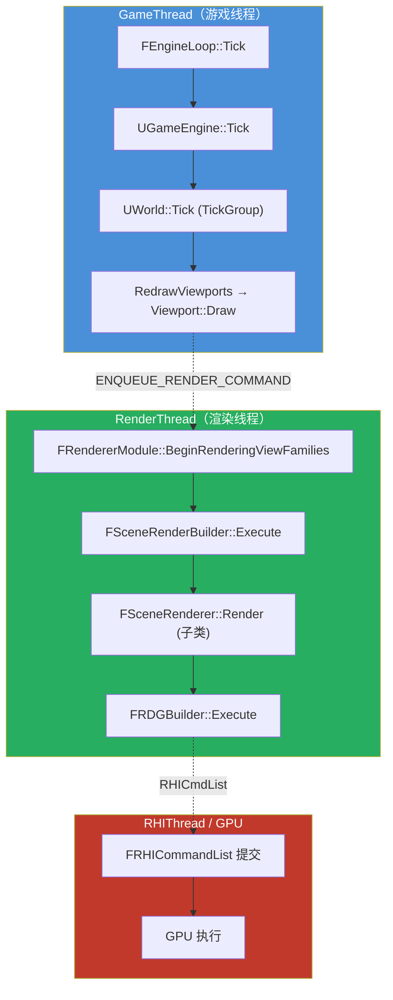

### 0.3 阶段职责速查

| 阶段 | 线程 | 关键入口 | 输入 | 输出 |
|------|------|----------|------|------|
| ① 初始化 | MainThread | [FEngineLoop::Init](file:///j:/UnrealSource/UnrealEngine/Engine/Source/Runtime/Launch/Private/LaunchEngineLoop.cpp#L4682) | 进程参数、.uproject | GEngine、GDynamicRHI、RenderThread、Shader 系统 |
| ② Tick | GameThread | [FEngineLoop::Tick](file:///j:/UnrealSource/UnrealEngine/Engine/Source/Runtime/Launch/Private/LaunchEngineLoop.cpp#L5536) | 输入、上一帧状态 | 更新后的 Actor/Component 状态 |
| ③ SceneProxy 同步 | GT→RT | [UWorld::SendAllEndOfFrameUpdates](file:///j:/UnrealSource/UnrealEngine/Engine/Source/Runtime/Engine/Private/LevelTick.cpp#L1346) | 脏标记的 Component | RT 端的 SceneProxy 更新 |
| ④ 渲染 | RenderThread | [FDeferredShadingSceneRenderer::Render](file:///j:/UnrealSource/UnrealEngine/Engine/Source/Runtime/Renderer/Private/DeferredShadingRenderer.cpp#L1736) | ViewFamily、SceneProxy | 最终像素到 Swapchain |

---

## 1. 引擎初始化阶段

### 1.1 关键类关系

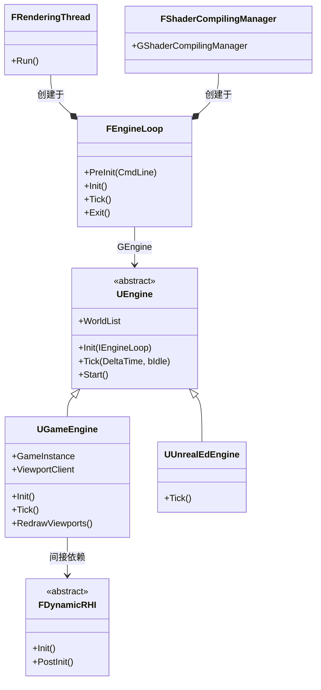

### 1.2 初始化时序图

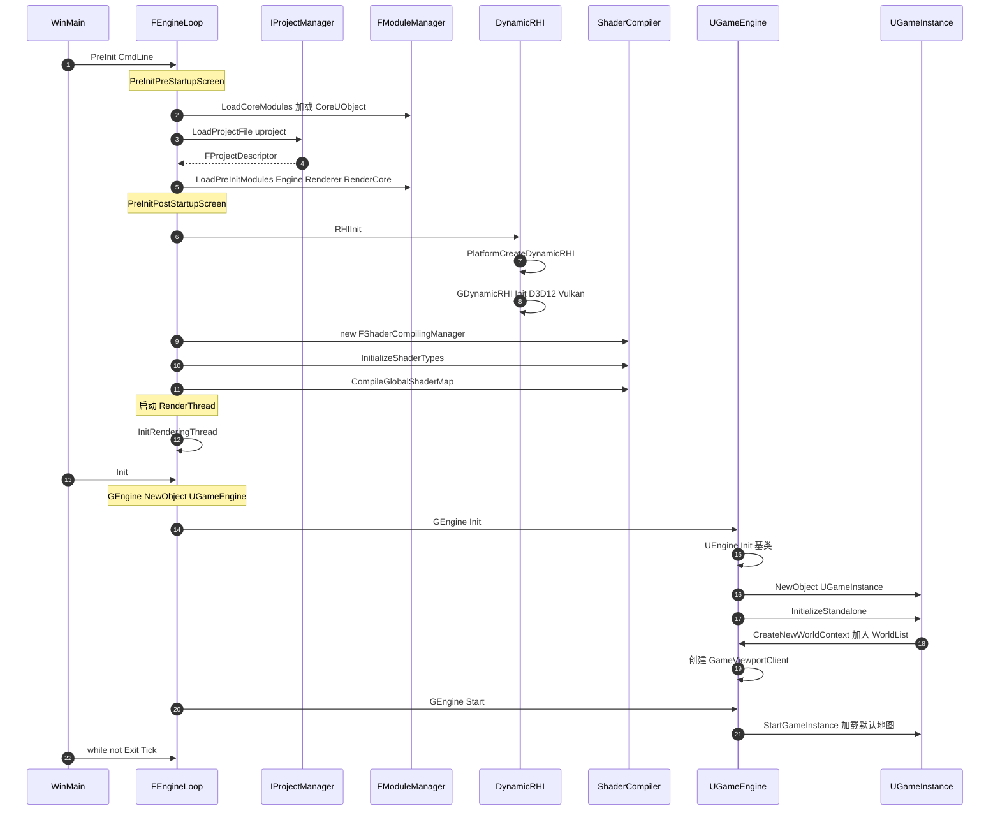

### 1.3 入口与启动流程

| 函数/对象 | 文件 | 行号 | 职责 |
|-----------|------|------|------|
| `WinMain` | [LaunchWindows.cpp](file:///j:/UnrealSource/UnrealEngine/Engine/Source/Runtime/Launch/Private/Windows/LaunchWindows.cpp#L315) | 315-337 | Windows 进程入口 |
| `GuardedMain` | [Launch.cpp](file:///j:/UnrealSource/UnrealEngine/Engine/Source/Runtime/Launch/Private/Launch.cpp#L87) | 87-205 | 静态主函数：PreInit→Init→Tick 循环 |
| `GEngineLoop`（全局） | [Launch.cpp](file:///j:/UnrealSource/UnrealEngine/Engine/Source/Runtime/Launch/Private/Launch.cpp#L28) | 28 | 全局 FEngineLoop 实例 |
| `class FEngineLoop` | [LaunchEngineLoop.h](file:///j:/UnrealSource/UnrealEngine/Engine/Source/Runtime/Launch/Public/LaunchEngineLoop.h#L48) | 48-200 | 引擎主循环类 |

### 1.4 FEngineLoop 关键函数

| 函数 | 文件 | 行号 | 职责 |
|------|------|------|------|
| `PreInit(const TCHAR*)` | [LaunchEngineLoop.cpp](file:///j:/UnrealSource/UnrealEngine/Engine/Source/Runtime/Launch/Private/LaunchEngineLoop.cpp#L4332) | 4332-4359 | PreInit 总入口 |
| `PreInitPreStartupScreen` | [LaunchEngineLoop.cpp](file:///j:/UnrealSource/UnrealEngine/Engine/Source/Runtime/Launch/Private/LaunchEngineLoop.cpp#L1699) | 1699-3385 | 解析命令行、加载核心模块、解析项目 |
| `PreInitPostStartupScreen` | [LaunchEngineLoop.cpp](file:///j:/UnrealSource/UnrealEngine/Engine/Source/Runtime/Launch/Private/LaunchEngineLoop.cpp#L3387) | 3387-4331 | RHI 初始化、Shader 编译 |
| `LoadCoreModules` | [LaunchEngineLoop.cpp](file:///j:/UnrealSource/UnrealEngine/Engine/Source/Runtime/Launch/Private/LaunchEngineLoop.cpp#L4361) | 4361-4371 | 仅加载 CoreUObject |
| `LoadPreInitModules` | [LaunchEngineLoop.cpp](file:///j:/UnrealSource/UnrealEngine/Engine/Source/Runtime/Launch/Private/LaunchEngineLoop.cpp#L4379) | 4379-4432 | Engine/Renderer/RenderCore/Landscape 等 |
| `LoadStartupCoreModules` | [LaunchEngineLoop.cpp](file:///j:/UnrealSource/UnrealEngine/Engine/Source/Runtime/Launch/Private/LaunchEngineLoop.cpp#L4438) | 4438-4601 | ~40 个运行时核心模块 |
| `LoadStartupModules` | [LaunchEngineLoop.cpp](file:///j:/UnrealSource/UnrealEngine/Engine/Source/Runtime/Launch/Private/LaunchEngineLoop.cpp#L4604) | 4604-4630 | 按 LoadingPhase 加载项目/插件模块 |
| `Init` | [LaunchEngineLoop.cpp](file:///j:/UnrealSource/UnrealEngine/Engine/Source/Runtime/Launch/Private/LaunchEngineLoop.cpp#L4682) | 4682-4908 | 创建 GEngine、调用 GEngine->Init |
| `Tick` | [LaunchEngineLoop.cpp](file:///j:/UnrealSource/UnrealEngine/Engine/Source/Runtime/Launch/Private/LaunchEngineLoop.cpp#L5536) | 5536-6168 | 每帧推进 |

### 1.5 UEngine / UGameEngine 关键函数

| 函数 | 文件 | 行号 | 职责 |
|------|------|------|------|
| GEngine 赋值点 | [LaunchEngineLoop.cpp](file:///j:/UnrealSource/UnrealEngine/Engine/Source/Runtime/Launch/Private/LaunchEngineLoop.cpp#L4714) | 4714 | `GEngine = NewObject<UEngine>(...)` |
| `GEngine->Init` 调用点 | [LaunchEngineLoop.cpp](file:///j:/UnrealSource/UnrealEngine/Engine/Source/Runtime/Launch/Private/LaunchEngineLoop.cpp#L4763) | 4763 | 触发引擎初始化 |
| `UEngine::Init` | [UnrealEngine.cpp](file:///j:/UnrealSource/UnrealEngine/Engine/Source/Runtime/Engine/Private/UnrealEngine.cpp#L2052) | 2052 | 基类初始化：Subsystem、Slate、Audio |
| `UGameEngine::Init` | [GameEngine.cpp](file:///j:/UnrealSource/UnrealEngine/Engine/Source/Runtime/Engine/Private/GameEngine.cpp#L1205) | 1205-1315 | 创建 GameInstance、ViewportClient |
| `UGameEngine::Start` | [GameEngine.cpp](file:///j:/UnrealSource/UnrealEngine/Engine/Source/Runtime/Engine/Private/GameEngine.cpp#L1317) | 1317 | GameInstance->StartGameInstance 加载默认地图 |
| GameInstance 创建 | [GameEngine.cpp](file:///j:/UnrealSource/UnrealEngine/Engine/Source/Runtime/Engine/Private/GameEngine.cpp#L1249) | 1249 | `NewObject<UGameInstance>` |
| `CreateNewWorldContext`（声明） | [Engine.h](file:///j:/UnrealSource/UnrealEngine/Engine/Source/Runtime/Engine/Classes/Engine/Engine.h#L3558) | 3558 | 按 EWorldType 创建上下文加入 WorldList |

### 1.6 RHI 初始化

| 函数/对象 | 文件 | 行号 | 职责 |
|-----------|------|------|------|
| `RHIInit` 调用点 | [LaunchEngineLoop.cpp](file:///j:/UnrealSource/UnrealEngine/Engine/Source/Runtime/Launch/Private/LaunchEngineLoop.cpp#L3111) | 3111 | PreInitPostStartupScreen 内 |
| `RHIInit` 实现 | [DynamicRHI.cpp](file:///j:/UnrealSource/UnrealEngine/Engine/Source/Runtime/RHI/Private/DynamicRHI.cpp#L278) | 278-364 | 创建 GDynamicRHI、协商 FeatureLevel |
| `PlatformCreateDynamicRHI`(Win) | [WindowsDynamicRHI.cpp](file:///j:/UnrealSource/UnrealEngine/Engine/Source/Runtime/RHI/Private/Windows/WindowsDynamicRHI.cpp#L1243) | 1243 | D3D11/D3D12/Vulkan 工厂 |
| `GDynamicRHI`（定义） | [DynamicRHI.cpp](file:///j:/UnrealSource/UnrealEngine/Engine/Source/Runtime/RHI/Private/DynamicRHI.cpp#L35) | 35 | 全局 `FDynamicRHI*` |

> 注意：**RHI 初始化位于 PreInit 阶段（不是 Init 阶段）**，在 Shader 系统初始化之前完成。

### 1.7 渲染线程启动

| 函数 | 文件 | 行号 | 职责 |
|------|------|------|------|
| `InitRenderingThread` | [RenderingThread.cpp](file:///j:/UnrealSource/UnrealEngine/Engine/Source/Runtime/RenderCore/Private/RenderingThread.cpp#L795) | 795-807 | UE_CALL_ONCE 保证只启动一次 |
| `StartRenderingThread` | [RenderingThread.cpp](file:///j:/UnrealSource/UnrealEngine/Engine/Source/Runtime/RenderCore/Private/RenderingThread.cpp#L562) | 562-654 | 真正创建 FRenderingThread + FRunnableThread |
| `class FRenderingThread` | [RenderingThread.cpp](file:///j:/UnrealSource/UnrealEngine/Engine/Source/Runtime/RenderCore/Private/RenderingThread.cpp#L324) | 324 | Run() 中调用 `FTaskGraphInterface::Get().ProcessThreadUntilRequestReturn` |
| `ShutdownRenderingThread` | [RenderingThread.cpp](file:///j:/UnrealSource/UnrealEngine/Engine/Source/Runtime/RenderCore/Private/RenderingThread.cpp#L809) | 809 | 停止渲染线程 |
| `GUseThreadedRendering` | [RenderingThread.cpp](file:///j:/UnrealSource/UnrealEngine/Engine/Source/Runtime/RenderCore/Private/RenderingThread.cpp#L49) | 49 | 渲染线程开关 |

### 1.8 Shader 系统

| 函数/对象 | 文件 | 行号 | 职责 |
|-----------|------|------|------|
| `GShaderCompilingManager = new` | [LaunchEngineLoop.cpp](file:///j:/UnrealSource/UnrealEngine/Engine/Source/Runtime/Launch/Private/LaunchEngineLoop.cpp#L3191) | 3191 | 全局 Shader 编译管理器 |
| `InitializeShaderTypes` | [LaunchEngineLoop.cpp](file:///j:/UnrealSource/UnrealEngine/Engine/Source/Runtime/Launch/Private/LaunchEngineLoop.cpp#L3235) | 3235 | 加载 Shader 前注册所有类型 |
| `CompileGlobalShaderMap` | [LaunchEngineLoop.cpp](file:///j:/UnrealSource/UnrealEngine/Engine/Source/Runtime/Launch/Private/LaunchEngineLoop.cpp#L3247) | 3247 | 编译/加载 Global Shaders |
| `FShaderCompilingManager` | [ShaderCompiler.cpp](file:///j:/UnrealSource/UnrealEngine/Engine/Source/Runtime/Engine/Private/ShaderCompiler/ShaderCompiler.cpp#L727) | 727 | 启动工作线程 |
| `FShaderType` | [Shader.h](file:///j:/UnrealSource/UnrealEngine/Engine/Source/Runtime/RenderCore/Public/Shader.h#L1237) | 1237 | Shader 类型元信息 |

### 1.9 关键全局对象

| 全局对象 | 类型 | 定义位置 |
|----------|------|----------|
| `GEngine` | `UEngine*` | [UnrealEngine.cpp:427](file:///j:/UnrealSource/UnrealEngine/Engine/Source/Runtime/Engine/Private/UnrealEngine.cpp#L427) |
| `GWorld` | `UWorldProxy` | [World.cpp:748](file:///j:/UnrealSource/UnrealEngine/Engine/Source/Runtime/Engine/Private/World.cpp#L748) |
| `GDynamicRHI` | `FDynamicRHI*` | [DynamicRHI.cpp:35](file:///j:/UnrealSource/UnrealEngine/Engine/Source/Runtime/RHI/Private/DynamicRHI.cpp#L35) |
| `GUseThreadedRendering` | `bool` | [RenderingThread.cpp:49](file:///j:/UnrealSource/UnrealEngine/Engine/Source/Runtime/RenderCore/Private/RenderingThread.cpp#L49) |
| `GThreadPool` | `FQueuedThreadPool*` | [ThreadingBase.cpp:48](file:///j:/UnrealSource/UnrealEngine/Engine/Source/Runtime/Core/Private/HAL/ThreadingBase.cpp#L48) |
| `GEngineLoop` | `FEngineLoop` | [Launch.cpp:28](file:///j:/UnrealSource/UnrealEngine/Engine/Source/Runtime/Launch/Private/Launch.cpp#L28) |

---

## 2. GameThread Tick 与 WorldTick

### 2.1 Tick 函数调用链

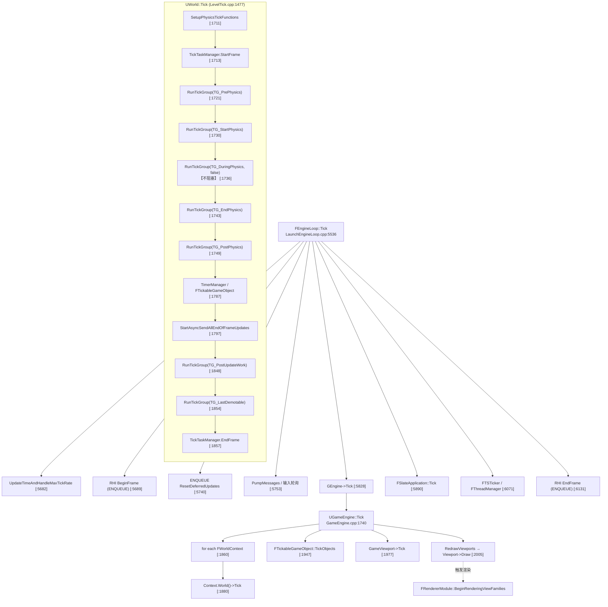

### 2.2 TickGroup 顺序与因果性（重点）

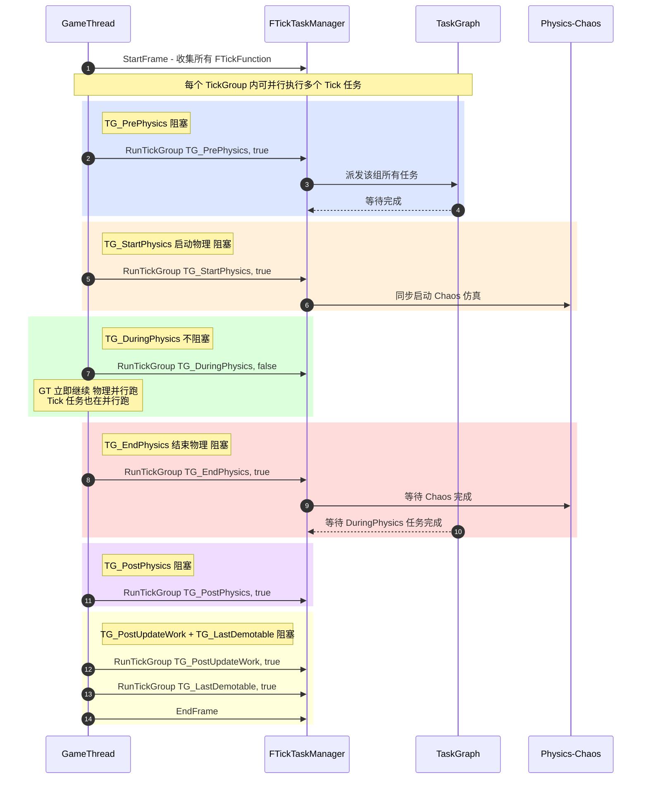

### 2.3 ETickingGroup 枚举

| 枚举值 | 行号 | 语义 | 阻塞 |
|--------|------|------|------|
| `TG_PrePhysics` | [EngineBaseTypes.h:86](file:///j:/UnrealSource/UnrealEngine/Engine/Source/Runtime/Engine/Classes/Engine/EngineBaseTypes.h#L86) | 物理仿真开始前 | 阻塞 |
| `TG_StartPhysics` | [EngineBaseTypes.h:89](file:///j:/UnrealSource/UnrealEngine/Engine/Source/Runtime/Engine/Classes/Engine/EngineBaseTypes.h#L89) | 启动物理（Hidden） | 阻塞 |
| `TG_DuringPhysics` | [EngineBaseTypes.h:92](file:///j:/UnrealSource/UnrealEngine/Engine/Source/Runtime/Engine/Classes/Engine/EngineBaseTypes.h#L92) | 与物理并行 | **不阻塞** |
| `TG_EndPhysics` | [EngineBaseTypes.h:95](file:///j:/UnrealSource/UnrealEngine/Engine/Source/Runtime/Engine/Classes/Engine/EngineBaseTypes.h#L95) | 结束物理（Hidden） | 阻塞 |
| `TG_PostPhysics` | [EngineBaseTypes.h:98](file:///j:/UnrealSource/UnrealEngine/Engine/Source/Runtime/Engine/Classes/Engine/EngineBaseTypes.h#L98) | 物理完成后 | 阻塞 |
| `TG_PostUpdateWork` | [EngineBaseTypes.h:101](file:///j:/UnrealSource/UnrealEngine/Engine/Source/Runtime/Engine/Classes/Engine/EngineBaseTypes.h#L101) | 更新工作完成后 | 阻塞 |
| `TG_LastDemotable` | [EngineBaseTypes.h:104](file:///j:/UnrealSource/UnrealEngine/Engine/Source/Runtime/Engine/Classes/Engine/EngineBaseTypes.h#L104) | 降级 Tick 兜底（Hidden） | 阻塞 |
| `TG_NewlySpawned` | [EngineBaseTypes.h:107](file:///j:/UnrealSource/UnrealEngine/Engine/Source/Runtime/Engine/Classes/Engine/EngineBaseTypes.h#L107) | 新 spawned（每帧末反复重跑） | 阻塞 |

### 2.4 Tick 并行化核心类

> **注意**：UE5 中**不存在** `FTickFunctionManager` / `ULevel::Tick`，实际承担职责的是 `FTickTaskManager` + `FTickTaskLevel`，`FDeferredUpdateInterface` 实为 `FDeferredUpdateResource`。

| 函数/类 | 文件 | 行号 | 职责 |
|---------|------|------|------|
| `ETickingGroup` 枚举 | [EngineBaseTypes.h](file:///j:/UnrealSource/UnrealEngine/Engine/Source/Runtime/Engine/Classes/Engine/EngineBaseTypes.h#L83) | 83-110 | TickGroup 定义 |
| `FTickFunction` | [EngineBaseTypes.h](file:///j:/UnrealSource/UnrealEngine/Engine/Source/Runtime/Engine/Classes/Engine/EngineBaseTypes.h#L187) | 187 | 单个 Tick 函数抽象 |
| `FTickTaskManagerInterface` | [TickTaskManagerInterface.h](file:///j:/UnrealSource/UnrealEngine/Engine/Source/Runtime/Engine/Public/TickTaskManagerInterface.h#L18) | 18 | 抽象接口 |
| `FTickTaskManager` | [TickTaskManager.cpp](file:///j:/UnrealSource/UnrealEngine/Engine/Source/Runtime/Engine/Private/TickTaskManager.cpp#L1965) | 1965 | 实现类（单例） |
| `FTickTaskManager::StartFrame` | [TickTaskManager.cpp](file:///j:/UnrealSource/UnrealEngine/Engine/Source/Runtime/Engine/Private/TickTaskManager.cpp#L2000) | 2000 | 遍历 FTickTaskLevel 收集 Tick |
| `FTickTaskManager::RunTickGroup` | [TickTaskManager.cpp](file:///j:/UnrealSource/UnrealEngine/Engine/Source/Runtime/Engine/Private/TickTaskManager.cpp#L2115) | 2115-2167 | 派发并（可选）等待组完成 |
| `FTickTaskSequencer` | [TickTaskManager.cpp](file:///j:/UnrealSource/UnrealEngine/Engine/Source/Runtime/Engine/Private/TickTaskManager.cpp#L456) | 456 | 持 TickCompletionEvents，分发器 |
| `FTickTaskSequencer::ReleaseTickGroup` | [TickTaskManager.cpp](file:///j:/UnrealSource/UnrealEngine/Engine/Source/Runtime/Engine/Private/TickTaskManager.cpp#L933) | 933 | 真正并行分发+等待核心 |
| `FTickFunction::QueueTickFunction` | [TickTaskManager.cpp](file:///j:/UnrealSource/UnrealEngine/Engine/Source/Runtime/Engine/Private/TickTaskManager.cpp#L2617) | 2617 | 按 Prerequisite 构建依赖图 |

### 2.5 关键 Tick 函数

| 函数 | 文件 | 行号 | 职责 |
|------|------|------|------|
| `FEngineLoop::Tick` | [LaunchEngineLoop.cpp](file:///j:/UnrealSource/UnrealEngine/Engine/Source/Runtime/Launch/Private/LaunchEngineLoop.cpp#L5536) | 5536-6168 | 引擎每帧总入口 |
| `GEngine->Tick` 调用 | [LaunchEngineLoop.cpp](file:///j:/UnrealSource/UnrealEngine/Engine/Source/Runtime/Launch/Private/LaunchEngineLoop.cpp#L5828) | 5828 | 派发到 UGameEngine::Tick |
| `UGameEngine::Tick` | [GameEngine.cpp](file:///j:/UnrealSource/UnrealEngine/Engine/Source/Runtime/Engine/Private/GameEngine.cpp#L1740) | 1740 | 遍历 WorldList，每个 World.Tick |
| `UWorld::Tick` | [LevelTick.cpp](file:///j:/UnrealSource/UnrealEngine/Engine/Source/Runtime/Engine/Private/LevelTick.cpp#L1477) | 1477-1960 | 单 World 核心更新 |
| `AActor::Tick` | [Actor.cpp](file:///j:/UnrealSource/UnrealEngine/Engine/Source/Runtime/Engine/Private/Actor.cpp#L1971) | 1971 | 仅蓝图 ReceiveTick + LatentAction |

### 2.6 GT → RT 连接点

| 连接点 | 文件 | 行号 | 机制 |
|--------|------|------|------|
| RHI BeginFrame | [LaunchEngineLoop.cpp](file:///j:/UnrealSource/UnrealEngine/Engine/Source/Runtime/Launch/Private/LaunchEngineLoop.cpp#L5689) | 5689-5692 | `ENQUEUE_RENDER_COMMAND(BeginFrame)` |
| FScene::StartFrame | [LaunchEngineLoop.cpp](file:///j:/UnrealSource/UnrealEngine/Engine/Source/Runtime/Launch/Private/LaunchEngineLoop.cpp#L5694) | 5694-5700 | 每场景帧起始 |
| ResetDeferredUpdates | [LaunchEngineLoop.cpp](file:///j:/UnrealSource/UnrealEngine/Engine/Source/Runtime/Launch/Private/LaunchEngineLoop.cpp#L5740) | 5740-5744 | `FDeferredUpdateResource::ResetNeedsUpdate` |
| RHI EndFrame | [LaunchEngineLoop.cpp](file:///j:/UnrealSource/UnrealEngine/Engine/Source/Runtime/Launch/Private/LaunchEngineLoop.cpp#L6131) | 6131-6135 | `ENQUEUE_RENDER_COMMAND(EndFrame)` |
| `RedrawViewports` | [GameEngine.cpp](file:///j:/UnrealSource/UnrealEngine/Engine/Source/Runtime/Engine/Private/GameEngine.cpp#L2005) | 2005 | 触发渲染绘制 |
| `RedrawViewports` 实现 | [GameEngine.cpp](file:///j:/UnrealSource/UnrealEngine/Engine/Source/Runtime/Engine/Private/GameEngine.cpp#L775) | 775 | 调用 `GameViewport->Viewport->Draw()` |
| `FDeferredUpdateResource` | [TextureResource.h](file:///j:/UnrealSource/UnrealEngine/Engine/Source/Runtime/Engine/Public/TextureResource.h#L285) | 285 | 延迟更新资源（用户所称 FDeferredUpdateInterface） |

---

## 3. SceneProxy 构建与同步

### 3.1 类关系图（GT 与 RT 的镜像）

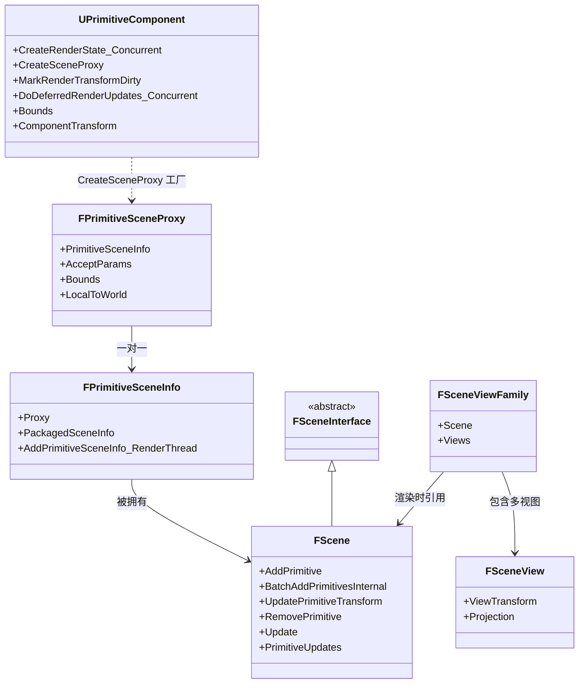

### 3.2 SceneProxy 生命周期与同步机制

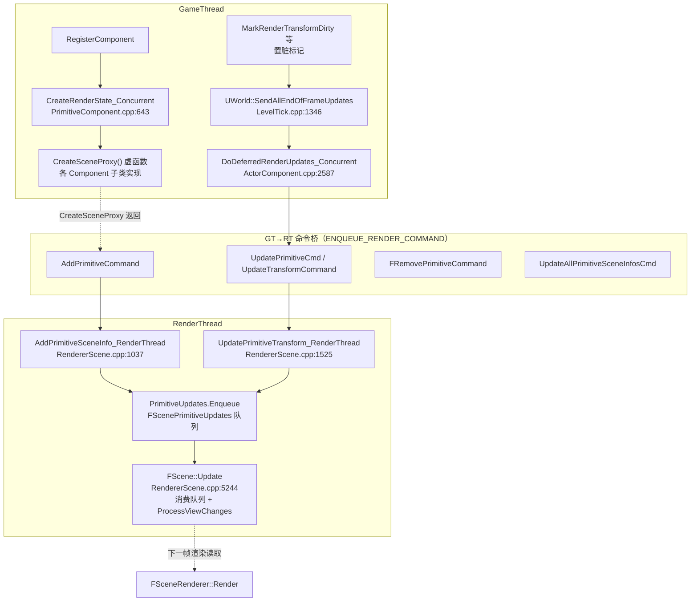

### 3.3 RenderCommandFence 同步机制

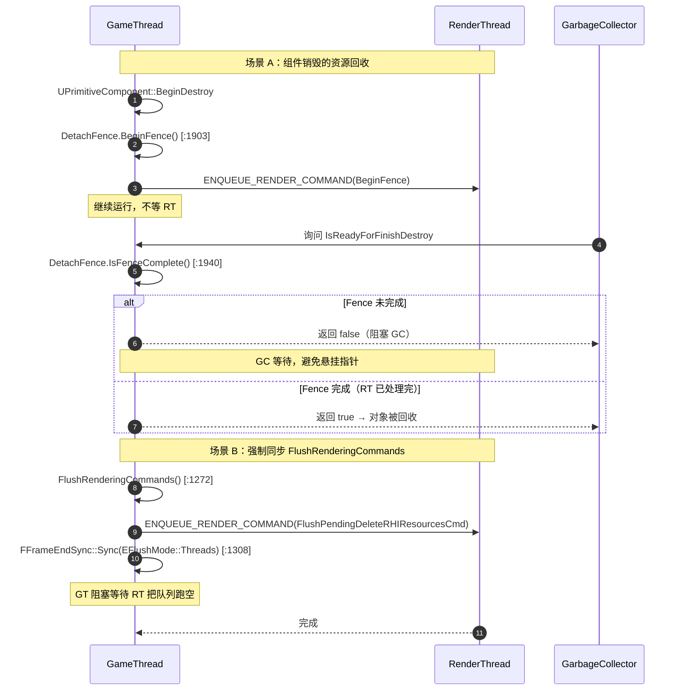

### 3.4 SceneProxy 核心类

| 类 | 文件 | 行号 | 职责 |
|----|------|------|------|
| `FPrimitiveSceneProxy` | [PrimitiveSceneProxy.h](file:///j:/UnrealSource/UnrealEngine/Engine/Source/Runtime/Engine/Public/PrimitiveSceneProxy.h#L295) | 295 | UPrimitiveComponent 的 RT 镜像 |
| `FPrimitiveSceneInfo` | [PrimitiveSceneInfo.h](file:///j:/UnrealSource/UnrealEngine/Engine/Source/Runtime/Renderer/Public/PrimitiveSceneInfo.h#L265) | 265 | SceneProxy 的渲染器内部伴随结构 |
| `FScene` | [ScenePrivate.h](file:///j:/UnrealSource/UnrealEngine/Engine/Source/Runtime/Renderer/Private/ScenePrivate.h#L2874) | 2874 | 渲染器私有的场景（UWorld 的 RT 版本） |
| `FSceneView` | [SceneView.h](file:///j:/UnrealSource/UnrealEngine/Engine/Source/Runtime/Engine/Public/SceneView.h#L1423) | 1423 | 单个视图（场景→屏幕投影） |
| `FSceneViewFamily` | [SceneView.h](file:///j:/UnrealSource/UnrealEngine/Engine/Source/Runtime/Engine/Public/SceneView.h#L2210) | 2210 | 共享 Scene 的视图集合 |
| `FSceneInterface` | [SceneInterface.h](file:///j:/UnrealSource/UnrealEngine/Engine/Source/Runtime/Engine/Public/SceneInterface.h) | — | FScene 的抽象基类 |

### 3.5 SceneProxy 创建链路

| 函数 | 文件 | 行号 | 职责 |
|------|------|------|------|
| `UPrimitiveComponent::CreateRenderState_Concurrent` | [PrimitiveComponent.cpp](file:///j:/UnrealSource/UnrealEngine/Engine/Source/Runtime/Engine/Private/Components/PrimitiveComponent.cpp#L643) | 643-676 | 创建渲染状态入口 |
| `UPrimitiveComponent::CreateSceneProxy` | [PrimitiveComponent.h](file:///j:/UnrealSource/UnrealEngine/Engine/Source/Runtime/Engine/Classes/Components/PrimitiveComponent.h#L2306) | 2306 | 工厂方法（基类返回 NULL） |
| `UStaticMeshComponent::CreateSceneProxy` | [StaticMeshSceneProxy.cpp](file:///j:/UnrealSource/UnrealEngine/Engine/Source/Runtime/Engine/Private/StaticMeshSceneProxy.cpp#L2918) | 2918 | 静态网格 SceneProxy |
| `USkinnedMeshComponent::CreateSceneProxy` | [SkinnedMeshComponent.cpp](file:///j:/UnrealSource/UnrealEngine/Engine/Source/Runtime/Engine/Private/Components/SkinnedMeshComponent.cpp#L588) | 588 | 骨骼网格 SceneProxy |
| `UInstancedStaticMeshComponent::CreateSceneProxy` | [InstancedStaticMesh.cpp](file:///j:/UnrealSource/UnrealEngine/Engine/Source/Runtime/Engine/Private/InstancedStaticMesh.cpp#L2578) | 2578 | 实例化静态网格 |
| `ULandscapeComponent::CreateSceneProxy` | [Landscape.cpp](file:///j:/UnrealSource/UnrealEngine/Engine/Source/Runtime/Landscape/Private/Landscape.cpp#L2084) | 2084 | 地形 |
| `FScene::AddPrimitive` | [RendererScene.cpp](file:///j:/UnrealSource/UnrealEngine/Engine/Source/Runtime/Renderer/Private/RendererScene.cpp#L1302) | 1302-1310 | 入口 |
| `FScene::BatchAddPrimitivesInternal` | [RendererScene.cpp](file:///j:/UnrealSource/UnrealEngine/Engine/Source/Runtime/Renderer/Private/RendererScene.cpp#L1343) | 1343-1475 | **创建链路核心**：CreateSceneProxy(1407)→new SceneInfo(1423)→ENQUEUE(1462) |
| `FScene::AddPrimitiveSceneInfo_RenderThread` | [RendererScene.cpp](file:///j:/UnrealSource/UnrealEngine/Engine/Source/Runtime/Renderer/Private/RendererScene.cpp#L1037) | 1037-1047 | RT 端入队 PrimitiveUpdates.EnqueueAdd |

### 3.6 每帧 SceneProxy 更新

| 函数 | 文件 | 行号 | 职责 |
|------|------|------|------|
| `UWorld::SendAllEndOfFrameUpdates` | [LevelTick.cpp](file:///j:/UnrealSource/UnrealEngine/Engine/Source/Runtime/Engine/Private/LevelTick.cpp#L1346) | 1346 | 帧末更新入口 |
| `UWorld::SendAllEndOfFrameUpdatesInternal` | [LevelTick.cpp](file:///j:/UnrealSource/UnrealEngine/Engine/Source/Runtime/Engine/Private/LevelTick.cpp#L1119) | 1119-1299 | 实际实现（可 ParallelFor） |
| `UActorComponent::DoDeferredRenderUpdates_Concurrent` | [ActorComponent.cpp](file:///j:/UnrealSource/UnrealEngine/Engine/Source/Runtime/Engine/Private/Components/ActorComponent.cpp#L2587) | 2587-2631 | **帧末分发器**：dirty→Recreate；否则 Send\* |
| `UActorComponent::RecreateRenderState_Concurrent` | [ActorComponent.cpp](file:///j:/UnrealSource/UnrealEngine/Engine/Source/Runtime/Engine/Private/Components/ActorComponent.cpp#L2510) | 2510 | Destroy+Create |
| `UActorComponent::MarkRenderStateDirty` | [ActorComponent.cpp](file:///j:/UnrealSource/UnrealEngine/Engine/Source/Runtime/Engine/Private/Components/ActorComponent.cpp#L2634) | 2634-2649 | 置 bRenderStateDirty |
| `UPrimitiveComponent::SendRenderTransform_Concurrent` | [PrimitiveComponent.cpp](file:///j:/UnrealSource/UnrealEngine/Engine/Source/Runtime/Engine/Private/Components/PrimitiveComponent.cpp#L678) | 678-691 | 调 Scene->UpdatePrimitiveTransform |
| `FScene::UpdatePrimitiveTransformInternal` | [RendererScene.cpp](file:///j:/UnrealSource/UnrealEngine/Engine/Source/Runtime/Renderer/Private/RendererScene.cpp#L1567) | 1567-1685 | **关键**：需重建则 Remove+Add；否则 TLS 累积 |
| `FScene::UpdatePrimitiveTransforms` | [RendererScene.cpp](file:///j:/UnrealSource/UnrealEngine/Engine/Source/Runtime/Renderer/Private/RendererScene.cpp#L1698) | 1698 | 帧末批量提交 |
| `FScene::UpdatePrimitiveTransform_RenderThread` | [RendererScene.cpp](file:///j:/UnrealSource/UnrealEngine/Engine/Source/Runtime/Renderer/Private/RendererScene.cpp#L1525) | 1525-1538 | RT 端入队 |

### 3.7 Scene 更新命令队列（数据结构层）

文件 [ScenePrimitiveUpdates.h](file:///j:/UnrealSource/UnrealEngine/Engine/Source/Runtime/Renderer/Private/ScenePrimitiveUpdates.h) 定义了：
- `EPrimitiveUpdateDirtyFlags`（行 14-37）：Transform/InstanceData/CullingBounds 等脏标记
- `EPrimitiveUpdateId`（行 39-52）：UpdateTransform / UpdateInstance / CustomPrimitiveData / DrawDistance 等
- `FUpdateTransformCommand`（行 61-68）、`FUpdateInstanceCommand`（行 70-76）等载荷
- `FScenePrimitiveUpdates`（行 54）：`TSceneUpdateCommandQueue<FPrimitiveSceneInfo, ...>`，所有增删改统一队列

### 3.8 RenderCommandFence 同步

| 项 | 文件 | 行号 | 职责 |
|----|------|------|------|
| `class FRenderCommandFence` | [RenderCommandFence.h](file:///j:/UnrealSource/UnrealEngine/Engine/Source/Runtime/RenderCore/Public/RenderCommandFence.h#L14) | 14-53 | GT 追踪挂起的渲染命令 |
| `enum ESyncDepth` | [RenderCommandFence.h](file:///j:/UnrealSource/UnrealEngine/Engine/Source/Runtime/RenderCore/Public/RenderCommandFence.h#L17) | 17-29 | RenderThread / RHIThread / Swapchain |
| `FRenderCommandFence::BeginFence` | [RenderingThread.cpp](file:///j:/UnrealSource/UnrealEngine/Engine/Source/Runtime/RenderCore/Private/RenderingThread.cpp#L978) | 978-1052 | 插入 fence（ENQUEUE_RENDER_COMMAND） |
| `FRenderCommandFence::Wait` | [RenderingThread.cpp](file:///j:/UnrealSource/UnrealEngine/Engine/Source/Runtime/RenderCore/Private/RenderingThread.cpp#L1258) | 1258-1267 | GameThreadWaitForTask |
| `FlushRenderingCommands` | [RenderingThread.cpp](file:///j:/UnrealSource/UnrealEngine/Engine/Source/Runtime/RenderCore/Private/RenderingThread.cpp#L1272) | 1272-1314 | **GT 等 RT 总函数**：FFrameEndSync::Sync |

> 本代码库中**不存在** `FlushRendering`（无后缀）和 `StartRenderCommandFence`，最接近的是 `FRenderCommandFence::BeginFence` 与 `StartRenderCommandFenceBundler`（[LaunchEngineLoop.cpp:3832](file:///j:/UnrealSource/UnrealEngine/Engine/Source/Runtime/Launch/Private/LaunchEngineLoop.cpp#L3832)，GC 期间优化用）。

### 3.9 整场景重建（FScene::Update）

| 函数 | 文件 | 行号 | 职责 |
|------|------|------|------|
| `FScene::UpdateAllPrimitiveSceneInfos` | [RendererScene.cpp](file:///j:/UnrealSource/UnrealEngine/Engine/Source/Runtime/Renderer/Private/RendererScene.cpp#L5159) | 5159 | 转 FScene::Update |
| `FScene::Update` | [RendererScene.cpp](file:///j:/UnrealSource/UnrealEngine/Engine/Source/Runtime/Renderer/Private/RendererScene.cpp#L5244) | 5244 | **RT 端整场景刷新核心**：处理 PrimitiveUpdates、ProcessViewChanges、刷新 GPUScene/Nanite/光追 |
| `FGlobalComponentRecreateRenderStateContext` | [ComponentRecreateRenderStateContext.h](file:///j:/UnrealSource/UnrealEngine/Engine/Source/Runtime/Engine/Public/ComponentRecreateRenderStateContext.h#L80) | 80-107 | RAII：构造销毁全部，析构重建 |

---

## 4. RDG 与 RenderPass 执行

### 4.1 渲染器继承体系

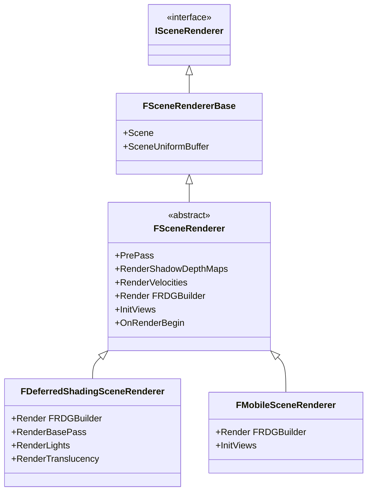

### 4.2 渲染入口 → Renderer 选择 → Render

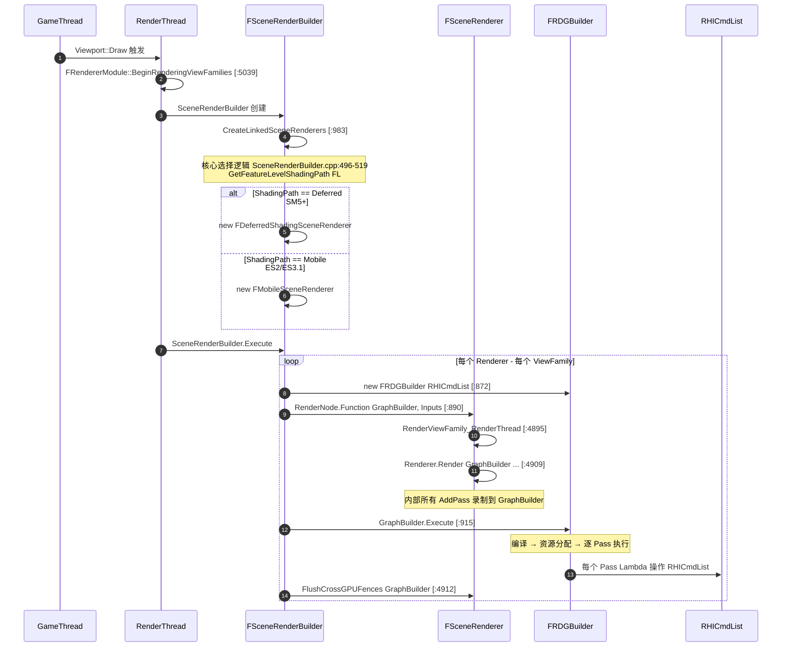

### 4.3 FDeferredShadingSceneRenderer::Render 全阶段

```mermaid
flowchart TB
    Start(["FDeferredShadingSceneRenderer::Render<br/>DeferredShadingRenderer.cpp:1736"])

    Start --> S1["OnRenderBegin [:1790]<br/>初始化任务/启动可见性任务"]
    S1 --> S2["CommitFinalPipelineState [:1816]"]
    S2 --> S3["BeginInitViews [:2052]<br/>SceneVisibility.cpp:5852"]

    subgraph Views["InitViews 子阶段"]
        V1["PreVisibilityFrameSetup"]
        V2["StartGatherDynamicMeshElements (GDME)"]
        V3["BeginInitDynamicShadows"]
        V4["EndInitViews [:2316]<br/>SceneVisibility.cpp:6000"]
    end
    S3 --> Views

    Views --> S4["Depth Prepass + EarlyZPass Velocity [:2393]"]
    S4 --> S5{"Shadow 提前?"}
    S5 -- 是 --> S6["RenderShadowDepthMaps (提前) [:2823/2849]"]
    S5 -- 否 --> S7
    S6 --> S7["CompositionLighting.ProcessBeforeBasePass<br/>DBuffer / Decal [:2859]"]
    S7 --> S8["RenderLumenSceneLighting [:2899]"]
    S8 --> S9["RenderBasePass (GBuffer) [:2905]<br/>BasePassRendering.cpp:1071"]
    S9 --> S10{"Shadow 提前?"}
    S10 -- 否 --> S11["RenderShadowDepthMaps (延迟) [:3130]"]
    S10 -- 是 --> S12
    S11 --> S12["RenderVelocities (Opaque, BasePass 未输出时) [:3213]"]
    S12 --> S13["RenderDiffuseIndirectAndAO [:3265]"]
    S13 --> S14["RenderLights 延迟光照 [:3314]"]
    S14 --> S15["RenderTranslucencyLightingVolume [:3326]"]
    S15 --> S16["RenderLightShaftOcclusion [:3448]"]
    S16 --> S17["RenderFog 体积雾 [:3466]"]
    S17 --> S18["RenderTranslucency (Under/AboveWater) [:3520/3654]"]
    S18 --> S19["RenderLumen FrontLayerTranslucencyReflections [:3638]"]
    S19 --> S20["RenderVelocities (Translucent) [:3676]"]
    S20 --> S21["AddPostProcessingPasses [:3860-3943]<br/>PostProcessing.cpp:347"]
    S21 --> End(["Render 返回 → GraphBuilder.Execute"])

    style S9 fill:#e74c3c,color:#fff
    style S14 fill:#e67e22,color:#fff
    style S21 fill:#9b59b6,color:#fff
    style S8 fill:#1abc9c,color:#fff
```

### 4.4 RDG 系统类图

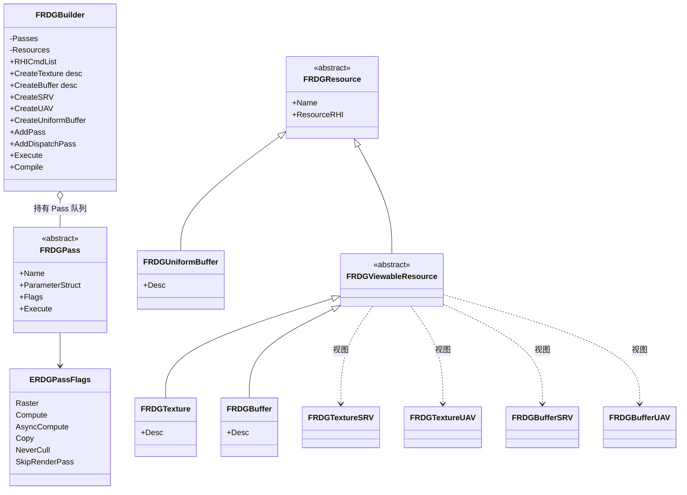

### 4.5 RDG Execute 内部流程

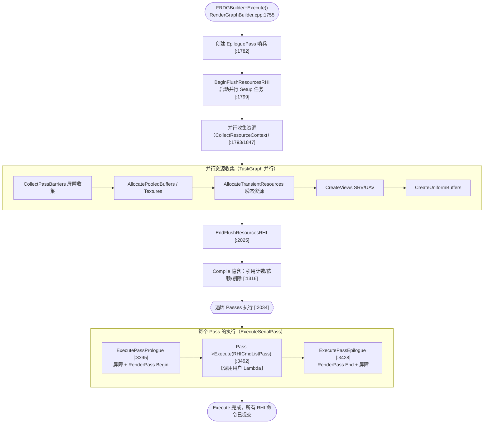

### 4.6 渲染入口与 Renderer 选择

| 函数/类 | 文件 | 行号 | 职责 |
|---------|------|------|------|
| `FRendererModule::BeginRenderingViewFamilies` | [SceneRendering.cpp](file:///j:/UnrealSource/UnrealEngine/Engine/Source/Runtime/Renderer/Private/SceneRendering.cpp#L5039) | 5039-5226 | GT 入口 |
| `RenderViewFamily_RenderThread` | [SceneRendering.cpp](file:///j:/UnrealSource/UnrealEngine/Engine/Source/Runtime/Renderer/Private/SceneRendering.cpp#L4895) | 4895-4913 | RT 实际入口，调用 Renderer->Render |
| `FSceneRendererBase` | [SceneRendering.h](file:///j:/UnrealSource/UnrealEngine/Engine/Source/Runtime/Renderer/Private/SceneRendering.h#L2022) | 2022 | 抽象基类 |
| `FSceneRenderer` | [SceneRendering.h](file:///j:/UnrealSource/UnrealEngine/Engine/Source/Runtime/Renderer/Private/SceneRendering.h#L2079) | 2079 | 核心抽象（含 PrePass/Shadow/Velocity） |
| `FSceneRenderer::Render`（纯虚） | [SceneRendering.h](file:///j:/UnrealSource/UnrealEngine/Engine/Source/Runtime/Renderer/Private/SceneRendering.h#L2203) | 2203 | `virtual void Render(FRDGBuilder&, ...) = 0` |
| `FDeferredShadingSceneRenderer` | [DeferredShadingRenderer.h](file:///j:/UnrealSource/UnrealEngine/Engine/Source/Runtime/Renderer/Private/DeferredShadingRenderer.h#L316) | 316 | 延迟着色（SM5+） |
| `FMobileSceneRenderer` | [SceneRendering.h](file:///j:/UnrealSource/UnrealEngine/Engine/Source/Runtime/Renderer/Private/SceneRendering.h#L2807) | 2807 | 移动前向 |
| `FSceneRenderBuilder::CreateSceneRenderers` | [SceneRenderBuilder.cpp](file:///j:/UnrealSource/UnrealEngine/Engine/Source/Runtime/Renderer/Private/SceneRenderBuilder.cpp#L475) | 475-555 | **核心选择逻辑**（496-519） |
| `FSceneRenderBuilder::Execute` 内创建 GraphBuilder | [SceneRenderBuilder.cpp](file:///j:/UnrealSource/UnrealEngine/Engine/Source/Runtime/Renderer/Private/SceneRenderBuilder.cpp#L872) | 872 | 每个 Renderer 独立 FRDGBuilder |
| `GraphBuilder.Execute()` 提交点 | [SceneRenderBuilder.cpp](file:///j:/UnrealSource/UnrealEngine/Engine/Source/Runtime/Renderer/Private/SceneRenderBuilder.cpp#L915) | 915 | 每个 Renderer 一个图 |

### 4.7 FDeferredShadingSceneRenderer::Render 关键步骤

| 阶段 | 文件 | 行号 | 职责 |
|------|------|------|------|
| `Render` | [DeferredShadingRenderer.cpp](file:///j:/UnrealSource/UnrealEngine/Engine/Source/Runtime/Renderer/Private/DeferredShadingRenderer.cpp#L1736) | 1736-3980 | 每帧渲染总调度 |
| `OnRenderBegin` | [SceneRendering.cpp](file:///j:/UnrealSource/UnrealEngine/Engine/Source/Runtime/Renderer/Private/SceneRendering.cpp#L3913) | 3913 | 起始，启动可见性任务 |
| `FMobileSceneRenderer::Render` | [MobileShadingRenderer.cpp](file:///j:/UnrealSource/UnrealEngine/Engine/Source/Runtime/Renderer/Private/MobileShadingRenderer.cpp#L1027) | 1027 | 移动端入口 |

### 4.8 InitViews 阶段

| 函数 | 文件 | 行号 | 职责 |
|------|------|------|------|
| `FDeferredShadingSceneRenderer::BeginInitViews` | [SceneVisibility.cpp](file:///j:/UnrealSource/UnrealEngine/Engine/Source/Runtime/Renderer/Private/SceneVisibility.cpp#L5852) | 5852-5998 | 启动可见性、GDME、动态阴影任务 |
| `FDeferredShadingSceneRenderer::EndInitViews` | [SceneVisibility.cpp](file:///j:/UnrealSource/UnrealEngine/Engine/Source/Runtime/Renderer/Private/SceneVisibility.cpp#L6000) | 6000-6047 | 完成可见性、同步、更新 ILC/反射捕获 |
| `FMobileSceneRenderer::InitViews` | [MobileShadingRenderer.cpp](file:///j:/UnrealSource/UnrealEngine/Engine/Source/Runtime/Renderer/Private/MobileShadingRenderer.cpp#L461) | 461 | 移动端（非异步拆分） |
| `LaunchVisibilityTasks` | [SceneRendering.cpp](file:///j:/UnrealSource/UnrealEngine/Engine/Source/Runtime/Renderer/Private/SceneRendering.cpp#L4058) | 4058 | 启动 CPU 可见性剔除并行任务 |

### 4.9 RDG 核心（FRDGBuilder）

> **重要**：RDG 实现位于 **`Runtime\RenderCore`**（不是 RHI）。

| 成员 | 文件 | 行号 | 职责 |
|------|------|------|------|
| `class FRDGBuilder` | [RenderGraphBuilder.h](file:///j:/UnrealSource/UnrealEngine/Engine/Source/Runtime/RenderCore/Public/RenderGraphBuilder.h#L47) | 47 | 构建器主类 |
| 构造函数（持 RHICmdList 引用） | [RenderGraphBuilder.cpp](file:///j:/UnrealSource/UnrealEngine/Engine/Source/Runtime/RenderCore/Private/RenderGraphBuilder.cpp#L575) | 575-580 | 接收外部 RHICmdList |
| `CreateTexture` | [RenderGraphBuilder.h](file:///j:/UnrealSource/UnrealEngine/Engine/Source/Runtime/RenderCore/Public/RenderGraphBuilder.h#L101) | 101 | 创建图跟踪纹理 |
| `CreateBuffer` | [RenderGraphBuilder.h](file:///j:/UnrealSource/UnrealEngine/Engine/Source/Runtime/RenderCore/Public/RenderGraphBuilder.h#L107) | 107 | 创建图跟踪缓冲 |
| `CreateUniformBuffer` | [RenderGraphBuilder.h](file:///j:/UnrealSource/UnrealEngine/Engine/Source/Runtime/RenderCore/Public/RenderGraphBuilder.h#L147) | 147 | 创建 UniformBuffer |
| `AddPass`（3 重载） | [RenderGraphBuilder.h](file:///j:/UnrealSource/UnrealEngine/Engine/Source/Runtime/RenderCore/Public/RenderGraphBuilder.h#L218) | 218/222/230 | 添加 Pass |
| `AddDispatchPass` | [RenderGraphBuilder.h](file:///j:/UnrealSource/UnrealEngine/Engine/Source/Runtime/RenderCore/Public/RenderGraphBuilder.h#L237) | 237 | 并行命令列表派发 Pass |
| `AddPassDependency` | [RenderGraphBuilder.h](file:///j:/UnrealSource/UnrealEngine/Engine/Source/Runtime/RenderCore/Public/RenderGraphBuilder.h#L246) | 246 | 用户定义 Pass 间依赖 |
| **`Execute`** | [RenderGraphBuilder.cpp](file:///j:/UnrealSource/UnrealEngine/Engine/Source/Runtime/RenderCore/Private/RenderGraphBuilder.cpp#L1755) | 1755 | **核心：编译+执行整个图** |
| `Compile` | [RenderGraphBuilder.cpp](file:///j:/UnrealSource/UnrealEngine/Engine/Source/Runtime/RenderCore/Private/RenderGraphBuilder.cpp#L1316) | 1316 | 引用计数、依赖、剔除 |
| `ExecutePass` | [RenderGraphBuilder.cpp](file:///j:/UnrealSource/UnrealEngine/Engine/Source/Runtime/RenderCore/Private/RenderGraphBuilder.cpp#L3482) | 3482-3495 | 执行单 Pass（Prologue→Execute→Epilogue） |
| `ExecuteSerialPass` | [RenderGraphBuilder.cpp](file:///j:/UnrealSource/UnrealEngine/Engine/Source/Runtime/RenderCore/Private/RenderGraphBuilder.cpp#L3497) | 3497-3543 | 串行执行（含验证） |
| `ExecutePassPrologue` / `Epilogue` | [RenderGraphBuilder.cpp](file:///j:/UnrealSource/UnrealEngine/Engine/Source/Runtime/RenderCore/Private/RenderGraphBuilder.cpp#L3395) | 3395 / 3428 | 屏障、RenderPass Begin/End |
| `SetupPassDependencies` | [RenderGraphBuilder.cpp](file:///j:/UnrealSource/UnrealEngine/Engine/Source/Runtime/RenderCore/Private/RenderGraphBuilder.cpp#L2319) | 2319 | 建立 Pass 间资源依赖 |
| `CompilePassOps` | [RenderGraphBuilder.cpp](file:///j:/UnrealSource/UnrealEngine/Engine/Source/Runtime/RenderCore/Private/RenderGraphBuilder.cpp#L2658) | 2658 | 合并 RenderPass |

### 4.10 RDG 资源与 Pass 类

| 类 | 文件 | 行号 | 职责 |
|----|------|------|------|
| `FRDGResource` | [RenderGraphResources.h](file:///j:/UnrealSource/UnrealEngine/Engine/Source/Runtime/RenderCore/Public/RenderGraphResources.h#L130) | 130 | 通用基类 |
| `FRDGTexture` | [RenderGraphResources.h](file:///j:/UnrealSource/UnrealEngine/Engine/Source/Runtime/RenderCore/Public/RenderGraphResources.h#L569) | 569 | 图纹理（final） |
| `FRDGBuffer` | [RenderGraphResources.h](file:///j:/UnrealSource/UnrealEngine/Engine/Source/Runtime/RenderCore/Public/RenderGraphResources.h#L1319) | 1319 | 图缓冲（final） |
| `FRDGUniformBuffer` | [RenderGraphResources.h](file:///j:/UnrealSource/UnrealEngine/Engine/Source/Runtime/RenderCore/Public/RenderGraphResources.h#L191) | 191 | UniformBuffer |
| `FRDGTextureSRV` / `UAV` | [RenderGraphResources.h](file:///j:/UnrealSource/UnrealEngine/Engine/Source/Runtime/RenderCore/Public/RenderGraphResources.h#L837) | 837 / 903 | 纹理视图 |
| `FRDGBufferSRV` / `UAV` | [RenderGraphResources.h](file:///j:/UnrealSource/UnrealEngine/Engine/Source/Runtime/RenderCore/Public/RenderGraphResources.h#L1424) | 1424 / 1450 | 缓冲视图 |
| `class FRDGPass` | [RenderGraphPass.h](file:///j:/UnrealSource/UnrealEngine/Engine/Source/Runtime/RenderCore/Public/RenderGraphPass.h#L216) | 216 | Pass 基类 |
| `ERDGPassFlags` | [RenderGraphPass.h](file:///j:/UnrealSource/UnrealEngine/Engine/Source/Runtime/RenderCore/Public/RenderGraphPass.h) | — | Raster/Compute/AsyncCompute/Copy/NeverCull/SkipRenderPass |
| `FRDGPass::Execute`（模板子类） | [RenderGraphPass.h](file:///j:/UnrealSource/UnrealEngine/Engine/Source/Runtime/RenderCore/Public/RenderGraphPass.h#L694) | 694-701 | 调用用户 Lambda |

### 4.11 关键 RenderPass 实现

| Pass | 函数 | 文件 | 行号 |
|------|------|------|------|
| GBuffer / BasePass | `FDeferredShadingSceneRenderer::RenderBasePass` | [BasePassRendering.cpp](file:///j:/UnrealSource/UnrealEngine/Engine/Source/Runtime/Renderer/Private/BasePassRendering.cpp#L1071) | 1071 |
| BasePass 内部 | `RenderBasePassInternal` | [BasePassRendering.cpp](file:///j:/UnrealSource/UnrealEngine/Engine/Source/Runtime/Renderer/Private/BasePassRendering.cpp#L1449) | 1449 |
| Shadow | `FSceneRenderer::RenderShadowDepthMaps` | [ShadowDepthRendering.cpp](file:///j:/UnrealSource/UnrealEngine/Engine/Source/Runtime/Renderer/Private/ShadowDepthRendering.cpp#L1678) | 1678 |
| Lumen GI | `RenderLumenSceneLighting` | [LumenSceneLighting.cpp](file:///j:/UnrealSource/UnrealEngine/Engine/Source/Runtime/Renderer/Private/Lumen/LumenSceneLighting.cpp#L217) | 217 |
| Velocity | `FSceneRenderer::RenderVelocities` | [VelocityRendering.cpp](file:///j:/UnrealSource/UnrealEngine/Engine/Source/Runtime/Renderer/Private/VelocityRendering.cpp#L520) | 520 |
| Translucency | `FDeferredShadingSceneRenderer::RenderTranslucency` | [TranslucentRendering.cpp](file:///j:/UnrealSource/UnrealEngine/Engine/Source/Runtime/Renderer/Private/TranslucentRendering.cpp#L1838) | 1838 |
| Translucency 内部 | `RenderTranslucencyInner` | [TranslucentRendering.cpp](file:///j:/UnrealSource/UnrealEngine/Engine/Source/Runtime/Renderer/Private/TranslucentRendering.cpp#L1465) | 1465 |
| 半透明光照体素 | `RenderTranslucencyLightingVolume` | [TranslucentLighting.cpp](file:///j:/UnrealSource/UnrealEngine/Engine/Source/Runtime/Renderer/Private/TranslucentLighting.cpp#L2660) | 2660 |
| PostProcessing | `AddPostProcessingPasses` | [PostProcessing.cpp](file:///j:/UnrealSource/UnrealEngine/Engine/Source/Runtime/Renderer/Private/PostProcess/PostProcessing.cpp#L347) | 347 |

### 4.12 Pass 在 Render 函数中的精确调用顺序

| 顺序 | 行号 | 调用 |
|------|------|------|
| 1 | 2316 | `EndInitViews(GraphBuilder, LumenFrameTemporaries, InstanceCullingManager, ...)` |
| 2 | 2396 | `RenderVelocities(...)`（EarlyZPass 时 Opaque 速度） |
| 3 | 2823 / 2849 | `RenderShadowDepthMaps(...)`（Forward 或可配置提前） |
| 4 | 2859 | `CompositionLighting.ProcessBeforeBasePass`（DBuffer / Decal） |
| 5 | 2899 | `RenderLumenSceneLighting(...)` |
| 6 | 2905 | `RenderBasePass(...)`（**GBuffer**） |
| 7 | 3130 | `RenderShadowDepthMaps(...)`（延迟阴影，未提前时） |
| 8 | 3213 | `RenderVelocities(...)`（Opaque 速度，BasePass 未输出） |
| 9 | 3265 | `RenderDiffuseIndirectAndAmbientOcclusion(...)` |
| 10 | 3314 | `RenderLights(...)`（**延迟光照**） |
| 11 | 3326 | `RenderTranslucencyLightingVolume(...)` |
| 12 | 3448 | `RenderLightShaftOcclusion(...)` |
| 13 | 3466 | `RenderFog(...)` |
| 14 | 3520 / 3654 | `RenderTranslucency(...)`（UnderWater / AboveWater） |
| 15 | 3638 | `RenderLumenFrontLayerTranslucencyReflections(...)` |
| 16 | 3676 | `RenderVelocities(...)`（Translucent 速度） |
| 17 | 3860-3943 | `AddPostProcessingPasses(...)`（**后处理**） |

### 4.13 RHI 提交链路

整个帧的 RHI 命令流：

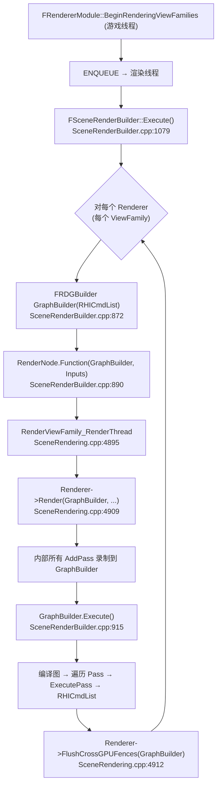

| 项 | 文件 | 行号 | 职责 |
|----|------|------|------|
| 每个 Renderer 的 `GraphBuilder.Execute` | [SceneRenderBuilder.cpp](file:///j:/UnrealSource/UnrealEngine/Engine/Source/Runtime/Renderer/Private/SceneRenderBuilder.cpp#L915) | 915 | 每个 ViewFamily 独立一个 RDG |
| `FSceneRenderer::FlushCrossGPUFences` | [SceneRendering.cpp](file:///j:/UnrealSource/UnrealEngine/Engine/Source/Runtime/Renderer/Private/SceneRendering.cpp#L3822) | 3822-3837 | 多 GPU 跨卡 Fence 同步 |
| `CleanupViewFamilies_RenderThread` | [SceneRendering.cpp](file:///j:/UnrealSource/UnrealEngine/Engine/Source/Runtime/Renderer/Private/SceneRendering.cpp#L4915) | 4915-5003 | 帧后清理（RayTracingScene.EndFrame 等） |
| `PerFrameCleanupIfSkipRenderer` | [SceneRendering.cpp](file:///j:/UnrealSource/UnrealEngine/Engine/Source/Runtime/Renderer/Private/SceneRendering.cpp#L5251) | 5251-5263 | `RHICmdList.ImmediateFlush(FlushRHIThreadFlushResources)` |
| 渲染线程唤醒 | [SceneRendering.cpp](file:///j:/UnrealSource/UnrealEngine/Engine/Source/Runtime/Renderer/Private/SceneRendering.cpp#L5221) | 5221-5224 | `WakeNamedThread(RenderThread)` |

---

## 5. 完整调用链总览

### 5.1 启动阶段（一次性）

```
WinMain (LaunchWindows.cpp:315)
  └─ LaunchWindowsStartup (185)
       └─ GuardedMainWrapper (113)
            └─ GuardedMain (Launch.cpp:87)
                 ├─ EnginePreInit → GEngineLoop.PreInit (LaunchEngineLoop.cpp:4332)
                 │    ├─ PreInitPreStartupScreen (1699)
                 │    │    ├─ LoadCoreModules (4361)              ← 加载 CoreUObject
                 │    │    ├─ IProjectManager::LoadProjectFile (2478)  ← 解析 .uproject
                 │    │    ├─ FTaskGraphInterface::Startup (2552)
                 │    │    ├─ LoadPreInitModules (4379)           ← Engine/Renderer/RenderCore
                 │    │    └─ LoadStartupCoreModules (4438)
                 │    └─ PreInitPostStartupScreen (3387)
                 │         ├─ RHIInit (3111)                      ← 创建 GDynamicRHI
                 │         ├─ GShaderCompilingManager = new (3191)
                 │         ├─ InitializeShaderTypes (3235)
                 │         ├─ CompileGlobalShaderMap (3247)
                 │         ├─ LoadStartupModules (4604)
                 │         └─ InitRenderingThread                  ← 启动渲染线程
                 │
                 ├─ EngineInit → GEngineLoop.Init (4682)
                 │    ├─ GEngine = NewObject<UEngine> (4714)
                 │    ├─ GEngine->Init(this) (4763)
                 │    │    └─ UGameEngine::Init (GameEngine.cpp:1205)
                 │    │         ├─ UEngine::Init (UnrealEngine.cpp:2052)
                 │    │         ├─ GameInstance = NewObject<UGameInstance> (1249)
                 │    │         │    └─ InitializeStandalone → CreateNewWorldContext
                 │    │         └─ 创建 GameViewportClient (1274)
                 │    └─ GEngine->Start() (4811)
                 │         └─ GameInstance->StartGameInstance → 加载默认地图
                 │
                 └─ while(!Exit) EngineTick → GEngineLoop.Tick (5536)
```

### 5.2 每帧阶段（循环）

```
FEngineLoop::Tick                              [LaunchEngineLoop.cpp:5536]
 ├─ UpdateTimeAndHandleMaxTickRate            [5682]
 ├─ RHI BeginFrame (ENQUEUE_RENDER_COMMAND)   [5689]
 ├─ FScene::StartFrame                        [5694]
 ├─ ENQUEUE ResetDeferredUpdates              [5740]
 ├─ PumpMessages / 输入轮询                    [5753, 5790]
 ├─ GEngine->Tick(...)                        [5828]
 │   └─ UGameEngine::Tick                     [GameEngine.cpp:1740]
 │       ├─ for each FWorldContext            [1860]
 │       │   ├─ TickWorldTravel               [1872]
 │       │   └─ Context.World()->Tick(...)    [1880]
 │       │       └─ UWorld::Tick              [LevelTick.cpp:1477]
 │       │           ├─ SetupPhysicsTickFunctions        [1711]
 │       │           ├─ TickTaskManager.StartFrame        [1713]
 │       │           ├─ RunTickGroup(TG_PrePhysics)       [1721]
 │       │           ├─ RunTickGroup(TG_StartPhysics)     [1730]
 │       │           ├─ RunTickGroup(TG_DuringPhysics, false) [1736]  ← 不阻塞
 │       │           ├─ RunTickGroup(TG_EndPhysics)       [1743]
 │       │           ├─ RunTickGroup(TG_PostPhysics)      [1749]
 │       │           ├─ TimerManager / FTickableGameObject [1787/1792]
 │       │           ├─ StartAsyncSendAllEndOfFrameUpdates [1797]
 │       │           │   └─ SendAllEndOfFrameUpdates → DoDeferredRenderUpdates
 │       │           │       └─ ENQUEUE_RENDER_COMMAND(UpdateTransform/Add/Remove)
 │       │           ├─ RunTickGroup(TG_PostUpdateWork)   [1848]
 │       │           ├─ RunTickGroup(TG_LastDemotable)    [1854]
 │       │           └─ TickTaskManager.EndFrame          [1857]
 │       ├─ FTickableGameObject::TickObjects   [1947]
 │       ├─ GameViewport->Tick                 [1977]
 │       ├─ RedrawViewports → Viewport->Draw   [2005 → 775 → 789]
 │       │   └─ 【GT→RT】触发一帧渲染：
 │       │       BeginRenderingViewFamilies (SceneRendering.cpp:5039)
 │       │       └─ SceneRenderBuilder 创建 + 选择 Renderer
 │       │       └─ ENQUEUE → RenderThread:
 │       │           FSceneRenderBuilder::Execute
 │       │           └─ new FRDGBuilder(RHICmdList)
 │       │           └─ Renderer->Render(GraphBuilder, ...)  [DeferredShadingRenderer.cpp:1736]
 │       │           │   ├─ OnRenderBegin [1790]
 │       │           │   ├─ BeginInitViews / EndInitViews [2052/2316]
 │       │           │   ├─ RenderBasePass (GBuffer) [2905]
 │       │           │   ├─ RenderLights [3314]
 │       │           │   ├─ RenderTranslucency [3520]
 │       │           │   └─ AddPostProcessingPasses [3860]
 │       │           └─ GraphBuilder.Execute()              [915]
 │       │               └─ 编译 → 资源分配 → 逐 Pass ExecutePass → RHICmdList
 │       └─ Streaming / Audio 更新              [2062/2070]
 ├─ FSlateApplication::Tick                    [5890/5960]
 ├─ FTSTicker / FThreadManager                 [6071/6072]
 ├─ GEngine->TickDeferredCommands              [6077]
 ├─ FCoreDelegates::OnEndFrame                 [6095]
 └─ RHI EndFrame (ENQUEUE_RENDER_COMMAND)      [6131]
```

---

## 6. 总结要点

1. **初始化顺序**：RHI 初始化（`RHIInit`）位于 **PreInit 阶段**（不是 Init 阶段），在 Shader 系统初始化之前完成。`GEngine` 在 Init 阶段创建。

2. **TickGroup 因果性**：`TG_DuringPhysics` 是唯一用 `bBlockTillComplete=false` 调用的组，允许 GameThread 与物理并行跑；后续 `TG_EndPhysics` 会阻塞等待。

3. **SceneProxy 是镜像**：`FPrimitiveSceneProxy` 是 UPrimitiveComponent 在渲染线程的**只读镜像**。GT 只能通过 `ENQUEUE_RENDER_COMMAND` 单向通信修改 RT 状态。

4. **整场景刷新**：所有增删改命令进入 `FScenePrimitiveUpdates` 队列，由 `FScene::Update`（[RendererScene.cpp:5244](file:///j:/UnrealSource/UnrealEngine/Engine/Source/Runtime/Renderer/Private/RendererScene.cpp#L5244)）在下一次渲染前一次性消费。

5. **RDG 在 RenderCore**：RDG 核心位于 `Runtime\RenderCore`（不是 RHI）。`FRDGBuilder::Execute`（[RenderGraphBuilder.cpp:1755](file:///j:/UnrealSource/UnrealEngine/Engine/Source/Runtime/RenderCore/Private/RenderGraphBuilder.cpp#L1755)）完成「编译 → 资源分配 → 逐 Pass 执行」。

6. **每个 ViewFamily 一个 RDG**：`SceneRenderBuilder.cpp:872` 创建独立 `FRDGBuilder`，行 915 执行——这意味着每个 ViewFamily 有独立的依赖图，而非整帧一个图。

7. **渲染器选择**：[SceneRenderBuilder.cpp:496-519](file:///j:/UnrealSource/UnrealEngine/Engine/Source/Runtime/Renderer/Private/SceneRenderBuilder.cpp#L496) 通过 `GetFeatureLevelShadingPath(FeatureLevel)` 决定 Deferred / Mobile。

---

## 7. 术语对照表（用户记忆 vs 实际源码）

| 用户提到的名称 | 实际源码名称 | 位置 |
|----------------|--------------|------|
| `FTickFunctionManager` | **`FTickTaskManager`**（+ `FTickTaskSequencer`） | [TickTaskManager.cpp:1965](file:///j:/UnrealSource/UnrealEngine/Engine/Source/Runtime/Engine/Private/TickTaskManager.cpp#L1965) / :456 |
| `QueueTickFunction` | `FTickFunction::QueueTickFunction` | [TickTaskManager.cpp:2617](file:///j:/UnrealSource/UnrealEngine/Engine/Source/Runtime/Engine/Private/TickTaskManager.cpp#L2617) |
| `FDeferredUpdateInterface` | **`FDeferredUpdateResource`** | [TextureResource.h:285](file:///j:/UnrealSource/UnrealEngine/Engine/Source/Runtime/Engine/Public/TextureResource.h#L285) |
| `StartRenderCommandFence` | `FRenderCommandFence::BeginFence` | [RenderingThread.cpp:978](file:///j:/UnrealSource/UnrealEngine/Engine/Source/Runtime/RenderCore/Private/RenderingThread.cpp#L978) |
| `FlushRendering` | **`FlushRenderingCommands`**（无后缀版本不存在） | [RenderingThread.cpp:1272](file:///j:/UnrealSource/UnrealEngine/Engine/Source/Runtime/RenderCore/Private/RenderingThread.cpp#L1272) |
| `ULevel::Tick` | **不存在**（由 `FTickTaskLevel` 驱动） | TickTaskManager.cpp |
| `GRHI` | **`GDynamicRHI`** + `GRHICommandList`（非单一指针） | [DynamicRHI.cpp:35](file:///j:/UnrealSource/UnrealEngine/Engine/Source/Runtime/RHI/Private/DynamicRHI.cpp#L35) |
| `FScene` 实现位置 | 已从 `SceneRendering.cpp` 迁移到 **`RendererScene.cpp`** | [RendererScene.cpp](file:///j:/UnrealSource/UnrealEngine/Engine/Source/Runtime/Renderer/Private/RendererScene.cpp) |